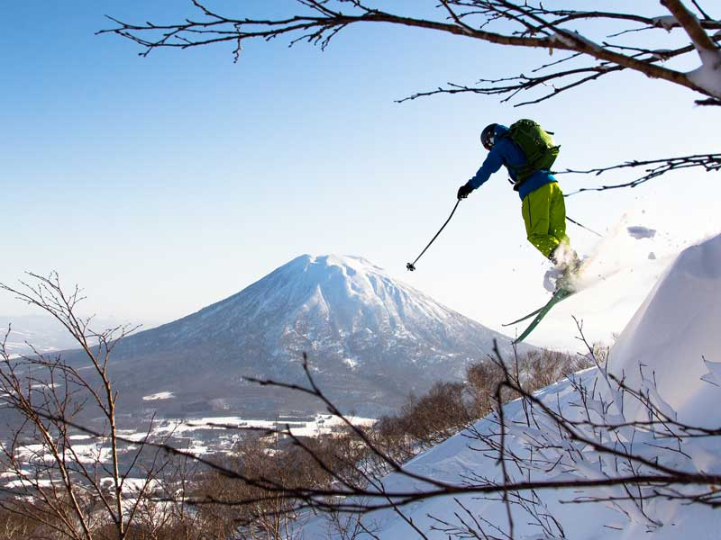

# ImageTranslation - Generative AI Image Captioning

<!DOCTYPE html>
<html>
    <body>
        <center>
            
            <p>'Skier In Mid Air Over Snowy Mountain With Mountain In Background'</p>
        </center>
    </body>
</html>


## Table of Contents

1. [Introduction](#introduction)
2. [Data](#data)
3. [Model](#model)
4. [Future Work](#future-work)
5. [Conclusion](#conclusion)
6. [References](#references)

## Introduction

Generative AI is a crucial in today's world, as it allows for the creation of new data that can be used for a variety of purposes. A common use case for generative ai is image captioning where we try to harness the power of transformers and neural networks to aid us in creating more natural and sophisticated text responses.

## Data

The user may input an image or a link to an image to generate text for that specified image.

## Model

For image captioning we will be using the [Salesforce Blip Image Claptioning Large](https://huggingface.co/Salesforce/blip-image-captioning-large) model and processing because it has proven to provide accurate quick captioning. An alternative to this model could be the [Salesforce Blip Image Claptioning Base](https://huggingface.co/Salesforce/blip-image-captioning-base) for a lighter weight alternative.

```python
from transformers import BlipProcessor, BlipForConditionalGeneration

# Model Name
hf_model="Salesforce/blip-image-captioning-large"

# Initialize Image-to-text Processor and Model
processor = BlipProcessor.from_pretrained(hf_model)
model = BlipForConditionalGeneration.from_pretrained(hf_model)
```

When processing the image and generating text output we can get the following results:

<!DOCTYPE html>
<html>
    <body>
        <center>
            
            <p>'A Man And A Woman In A Kayak Paddling In The Water'</p>
        </center>
    </body>
</html>

## Future-work

02-24-2024:

- As of now the model is used to generate a caption from images, and can do it relatively well, however, this model is limited and only captures the scene's main actions. It still lacks the capability of descibing all of the elements in the image, for example, the above sample image fails to describe the scenery and background. 
- Selecting a better model, or using a paid API like GPT-4 would yield better results on a large scale.
- Another transformer model could be trained/used to add more context to the image and allow for better descriptions.
- I would like to translate the text to different major languages and add text to speech capabilities for these languages.
- Would like to support dynamic video files for real time descriptions (.mp4, .mov, etc.) to better support those with vision-impairments.

## Conclusion

Overall, it can be seen that the model does describe most pictures with great accuracy, but there is still a lot of details that are left out that could be important. If we are to improve Image-to-text, we may want to join models that can describe actions well with models that can describe details well to improve the robustness of the captioning. If we are able to accomplish this well, we can provide a service that can accommodate those with vision-impairments in every language.


## References

1. [Hugging Face Transformers](https://huggingface.co/transformers/)
2. [Salesforce Blip Image Claptioning Large](https://huggingface.co/Salesforce/blip-image-captioning-large)
3. [Sample Image 1](https://www.google.com/url?sa=i&url=https%3A%2F%2Fwww.skijapan.com%2Fresorts%2F&psig=AOvVaw0CfuRjI2bG94MO2qPyNhpL&ust=1708889000940000&source=images&cd=vfe&opi=89978449&ved=0CBMQjRxqFwoTCPjhj-HZxIQDFQAAAAAdAAAAABAE)
4. [Sample Image 2](https://www.google.com/url?sa=i&url=https%3A%2F%2Fauthentiktravel.com%2Ftop-5-beautiful-destinations-kayaking-vietnam&psig=AOvVaw0jKQqBzYbNiM90yVC8JA29&ust=1708887385435000&source=images&cd=vfe&opi=89978449&ved=0CBMQjRxqFwoTCJCyhd_TxIQDFQAAAAAdAAAAABAJ)
